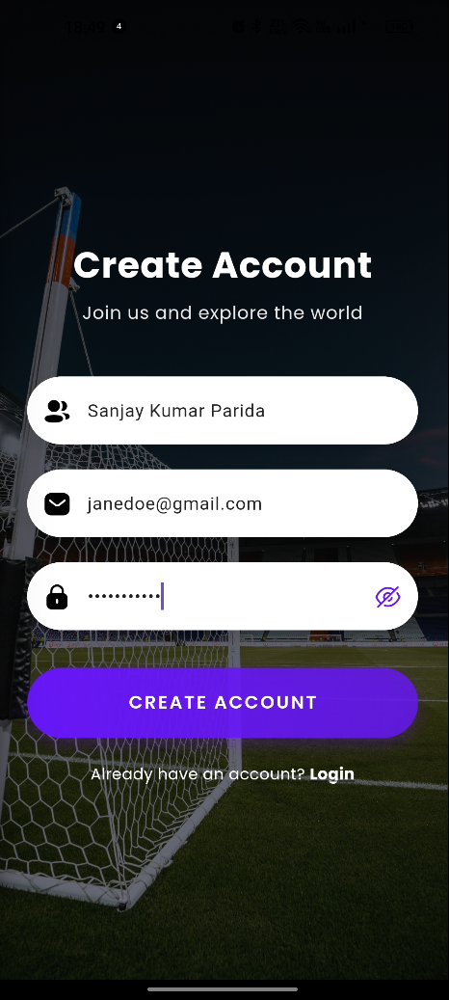
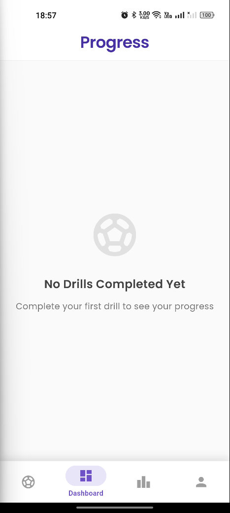

# NextKick
[](#)
[](#)

NextKick is a Flutter application designed for tracking football drill practices. The app features user authentication, drill management, progress tracking, and a global leaderboard system.

## ⚡️ Features
- User Authentication with session persistence
- Responsive UI design for mobile platform.
- Football drill catalog with detailed information
- Personal progress tracking dashboard
- Global leaderboard system
- Offline support with data synchronization

## 👩‍💻 Technologies Used
- **Flutter**: For cross-platform UI/UX
- **Dart**: Programming language
- **REST APIs**: Backend integration

## Snapshots
<table>
  <tr>
    <td></td>
    <td></td>
    <td></td>
    <td></td>
  </tr>
  <tr>
    <td></td>
    <td></td>
     <td></td>
     <td></td>
  </tr>
</table>


## ⏳ Installation

1. Clone the repository:
   ```
   git clone https://github.com/SanjayKParida/next-kick.git
   ```
2. Navigate to the project directory:
   ```
   cd next-kick
   ```
3. Install dependencies:
   ```
   flutter pub get
   ```

5. Run the app:
   ```
   flutter run
   ```
   
